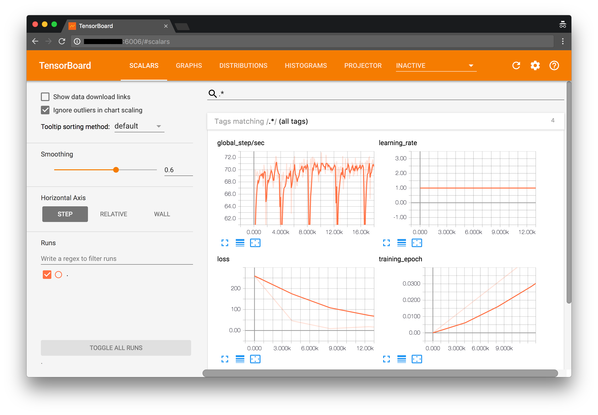
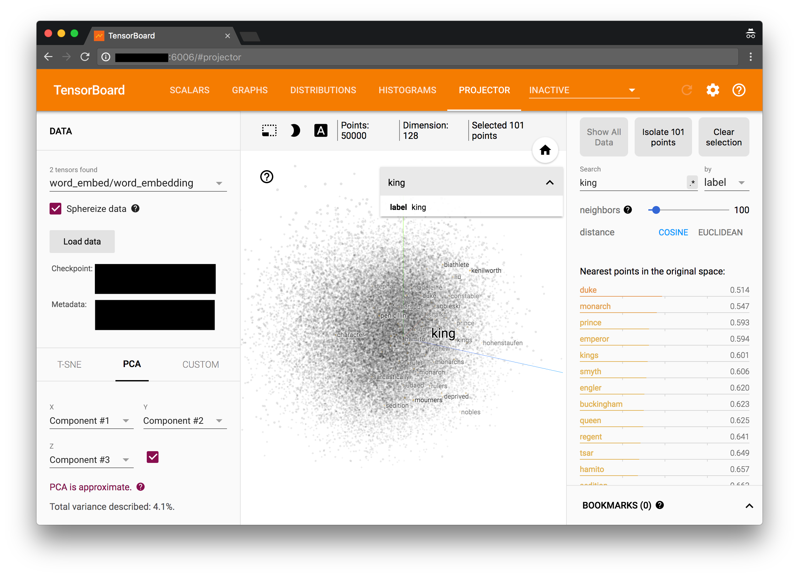

# Entity2Vec

基于 `TensorFlow` 的 `Word2vec` / `Thing2Vec` 的Python package.

## 特性
* 基于 `TensorFlow` 实现: 高效 可靠
* 应用领域灵活,将 `Word2Vec` 扩展至无限可能
* 全面功能的 `Dashboard` (感谢 `TensorBoard`)
* 支持海量数据: 支持规模达到T级别的数据

## 演示
### 训练监控
#### 标量监控
`global_step/sec`/`learning_rate`/`loss`/`training_epoch`

#### 计算图

#### 分布图

#### 柱形图

### 效果评估
##### PCA降维

##### T-SNE

##### 距离查询


## 教程
如下将通过Google官方的text8数据集来演示 `Entity2Vec`的使用
### 下载数据
下载`text8`数据集, 执行下面的命令
```bash
curl http://mattmahoney.net/dc/text8.zip > text8.zip
unzip text8.zip
```
你想得到`text8`这个数据文件
### 构建项目
执行下面的命令:
```bash
python -m entity2vec.shortcuts.preprocessor -p project -f text8
```
这个脚本将使用默认的设定来构建项目, `-f text8`指定了数据来源于`text8`, `-p project`指定了项目文件存放的位置`project`目录
### 训练模型
执行下面的命令:
```bash
python -m entity2vec.shortcuts.train -p project
```
这个脚本将使用默认的设定来训练模型, `-p project`指定了项目的位置在`project`目录中.
### 可视化监控
#### 启动服务器
```bash
tensorboard --logdir project/log
```
#### 启动浏览器
打开浏览器,输入服务器的地址和端口6006即可查看模型训练情况.如果是本机训练和查看,请直接点击: [http://localhost:6006](http://localhost:6006)
### 导出模型
执行下面的命令:
```bash
python -m entity2vec.shortcuts.export -p project
```
模型数据将会以兼容`gensim`包的格式导出纯文本模型,模型文件`gensim_compatible_word2vec.txt`位于`project`目录中